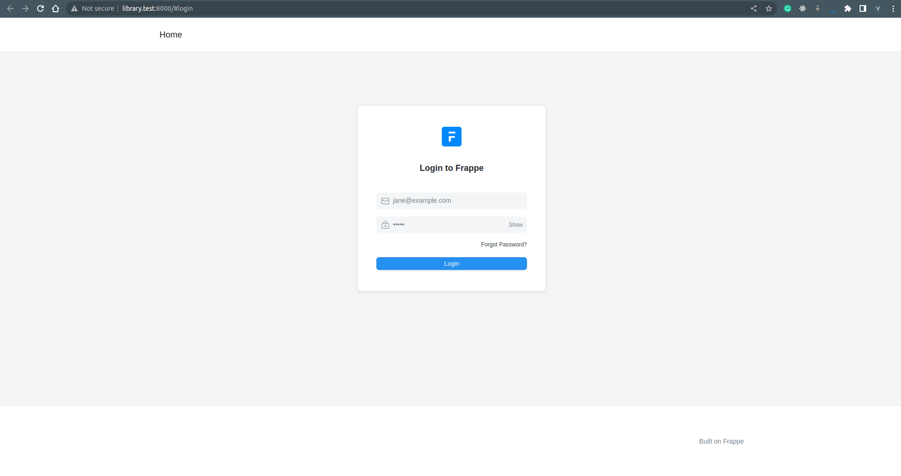
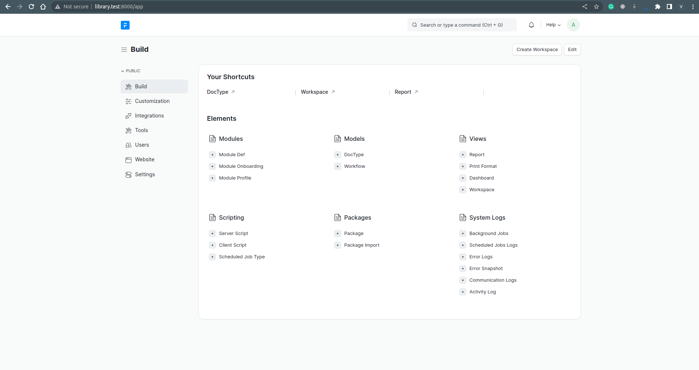
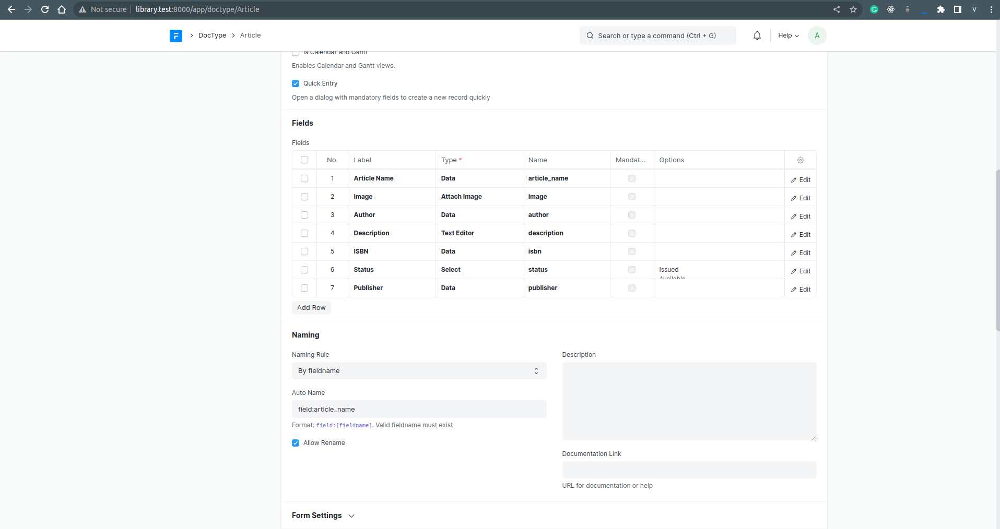
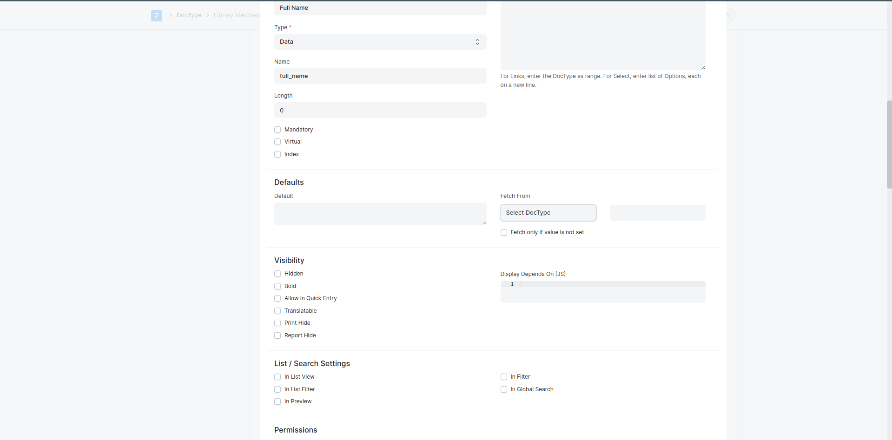

# Library Management with Frappe Framework

## Creating frappe-bench directory

Let's create our project folder which will contain our apps and sites. Run the following command:

```bash
bench init frappe-bench
```

This will create a directory named frappe-bench in your current working directory. It will do the following:

- Create a python virtual environment under env directory.
- Fetch and install the frappe app as a python package.
- Install node modules of frappe.
- Build static assets.

## Directory Structure

- env: Python virtual environment
- config: Config files for Redis and Nginx
- logs: Log files for every process (web, worker)
- sites: Sites directory
- assets: Static assets that served via Nginx in production
- apps.txt: List of installed frappe apps
- common_site_config.json: Site config that is available in all sites
- apps: Apps directory
- frappe: The Frappe app directory
- Procfile: List of processes that run in development

## Start bench server

Now that we have created our frappe-bench directory, we can start the Frappe web server by running the following command:

```bash
cd frappe-bench
bench start
```

This will start several processes including a Python web server based on Gunicorn, redis servers for caching, job queuing and socketio pub-sub, background workers, node server for socketio and a node server for compiling JS/CSS files.

The web server will start listening on the port 8000 but we don't have any sites yet to serve. Our next step is to create our app and create a site that will have this app installed.

Make sure not to close the terminal where bench start is running. To run bench commands, create another terminal and cd into the frappe-bench directory.

Good job on following the tutorial so far!

## Create app

To create our Library Management app, run the following command from the frappe-bench directory:

```bash
bench new-app library_management
```

## App directory structure

- library_management: This directory will contain all the source code for your app
  - public: Store static files that will be served from Nginx in production
  - templates: Jinja templates used to render web views
  - www: Web pages that are served based on their directory path
  - library_management: Default Module bootstrapped with app
  - modules.txt: List of modules defined in the app
  - patches.txt: Patch entries for database migrations
  - hooks.py: Hooks used to extend or intercept standard functionality provided by the framework
- requirements.txt: List of Python packages that will be installed when you install this app

## Create a new site

To create a new site, run the following command from the frappe-bench directory:

```bash
bench new-site library.test
```

This command will create a new database, so you need to enter your MySQL root password. It will also ask to set the password for the Administrator user, just set a password that you won't forget. This will be useful later.

Now, you will have a new folder named library.test in the sites directory.

## Site Directory Structure

As you can see, the `private` folder will contain any database backups and private files. Private files are user uploaded files that need authentication to be accessible.

The `public` folder will contain files that are accessible without authentication. This can contain website images that should be accessible without login.

The `site_config.json` file contains configuration that is specific to this site which should not be version controlled. This is similar to an environment variables file. If you look at the contents of the file, it contains the database configuration values for this site.

## Access Sites in you browser

Frappe will identify which site to serve by matching the hostname of the request with the site name, so you should be able to access your site on ` http://library.test:8000 ` but this won't work because we have to tell our operating system that library.test should point to localhost. To do that, you can add the following entry to your /etc/hosts file.

```bash
127.0.0.1 library.test
```

This will map library.test to localhost. Bench has a convenient command to do just that.

```bash
bench --site library.test add-to-hosts
```

This will ask for your root password and will add an entry to your /etc/hosts file.

Great, now you can access your site at ` http://library.test:8000 `. Congratulations for making it this far.

## Install App on Site

To install our Library Management app on our site, run the following command:

```bash
$ bench --site library.test install-app library_management

Installing library_management...
Updating Dashboard for library_management
```

You should see `frappe` and `library_management` as installed apps on your site.

When you create a new site, the `frappe` app is installed by default.

## Login into desk

To create DocTypes in our app, we must log in to Desk. Go to ` http://library.test:8000 ` and it should show you a login page.


Enter Administrator as the user and password that you set while creating the site.



After successful login, you will see the setup wizard. This is a one-time setup wizard used to set up the site. Go ahead, select your country and complete the wizard.

You should see the Desk that looks something like this:



Good job making it this far!

## Site Commands

` https://frappe.school/courses/frappe-framework-tutorial/learn/5.6 `

---

## Create a DocType

DocType is analogous to a Model in other frameworks. Apart from defining properties, it also defines the behavior of the Model.

Before we can create DocTypes, we need to enable developer mode. This will enable boilerplate creation when we create doctypes and we can track them into version control with our app.

Go to your terminal and from the frappe-bench directory, run the following command:

```bash
bench --site library.test set-config --global developer_mode 1
```

## Creating a DocType

While in Desk, type 'doctype' in the search bar and select the **DocType List** option. You will be navigated to the DocType list where you will see a bunch of DocTypes. These are the DocTypes that are bundled with the framework.

The first doctype we will create is **Article**. To create it, click on New.

- Enter Name as Article
- Select Library Management in Module
- Add the following fields in the Fields table:
  - Article Name (Data)
  - Image (Attach Image)
  - Author (Data)
  - Description (Text Editor)
  - ISBN (Data)
  - Status (Select) - Enter two options: Issued and Available (Type Issued, hit enter, then type Available)
  - Publisher (Data)

  After adding the fields, click on Save.

  <!--  -->

You will see a Go to Article List button at the top right of the form. Click on it to go to the Article List. Here you will see a blank list with no records because the table has no records.

Let's create some records. But before that, we need to clear the Desk cache. Click on the Settings dropdown on the right side of the navbar and click on Reload.

Now, you should see the New button. Click on it and you will see the Form view of the Article doctype. Fill in the form and click on Save. You have created your first Article document. Go back to the list view and you should see one record.

## What happened when you created the Article DocType?

- ### Database Table

A database table with the name `tabArticle` was created with the fields we specified in the fields table. You can confirm this by checking it from the MariaDB console

```bash
bench --site library.test mariadb

WARNING: Forcing protocol to  TCP  due to option specification. Please explicitly state intended protocol.
Welcome to the MariaDB monitor.  Commands end with ; or \g.
Your MariaDB connection id is 433
Server version: 10.6.12-MariaDB-0ubuntu0.22.04.1 Ubuntu 22.04

Copyright (c) 2000, 2018, Oracle, MariaDB Corporation Ab and others.

Type 'help;' or '\h' for help. Type '\c' to clear the current input statement.

MariaDB [_9321a152cb497eb3]> select * from tabArticle;
+------------+----------------------------+----------------------------+---------------+---------------+-----------+-----+-----------------------------+-------+-------------+------------------------------------>
| name       | creation                   | modified                   | modified_by   | owner         | docstatus | idx | article_name                | image | author      | description                        >
+------------+----------------------------+----------------------------+---------------+---------------+-----------+-----+-----------------------------+-------+-------------+------------------------------------>
| b0af436bcd | 2023-02-27 21:43:15.882797 | 2023-02-27 21:43:15.882797 | Administrator | Administrator |         0 |   0 | The Girl with all the gifts | NULL  | M.R. Marley | <div class="ql-editor read-mode"><p>
+------------+----------------------------+----------------------------+---------------+---------------+-----------+-----+-----------------------------+-------+-------------+------------------------------------>
1 row in set (0.001 sec)

MariaDB [_9321a152cb497eb3]> desc tabArticle;
+--------------+--------------+------+-----+---------+-------+
| Field        | Type         | Null | Key | Default | Extra |
+--------------+--------------+------+-----+---------+-------+
| name         | varchar(140) | NO   | PRI | NULL    |       |
| creation     | datetime(6)  | YES  |     | NULL    |       |
| modified     | datetime(6)  | YES  | MUL | NULL    |       |
| modified_by  | varchar(140) | YES  |     | NULL    |       |
| owner        | varchar(140) | YES  |     | NULL    |       |
| docstatus    | int(1)       | NO   |     | 0       |       |
| idx          | int(8)       | NO   |     | 0       |       |
| article_name | varchar(140) | YES  |     | NULL    |       |
| image        | text         | YES  |     | NULL    |       |
| author       | varchar(140) | YES  |     | NULL    |       |
| description  | longtext     | YES  |     | NULL    |       |
| isbn         | varchar(140) | YES  |     | NULL    |       |
| status       | varchar(140) | YES  |     | NULL    |       |
| publisher    | varchar(140) | YES  |     | NULL    |       |
| _user_tags   | text         | YES  |     | NULL    |       |
| _comments    | text         | YES  |     | NULL    |       |
| _assign      | text         | YES  |     | NULL    |       |
| _liked_by    | text         | YES  |     | NULL    |       |
+--------------+--------------+------+-----+---------+-------+
18 rows in set (0.001 sec)

MariaDB [_9321a152cb497eb3]>
```

The fields we specified in Title Case were converted to snake case automatically, and are used as the column names in the table. For e.g., `article_name`, `image`, `author` , and `description`.

However, many other fields were created like `name`, `creation`, `modified`, `modified_by` . These are standard fields created for all doctypes. `name` is the primary key column.

If you created a record with the Form, you can also run a standard select query to get the rows.

- ### Desk View

There are a number of views that were also created for our DocType. The Article List is the list view that shows the records from the database table. The Form view is the view that is shown when you want to create a new document or view an existing one.

- ### Form Layout

If you notice, the layout of fields in the form is according to how you ordered them in the Fields table. For e.g., Article Name is the first field followed by Image which is followed by Author. In later parts of the tutorial we will learn how to customize this further.

- ### Can't find  4. Boilerplate code

` https://frappe.school/courses/frappe-framework-tutorial/learn/6.3 `

I do find biolerplate code for library_member, library_membership docType which I created later on.

---

## Doctype Features

In the previous chapter, we created the Article doctype. Let's see what other features we can customize.

## Naming

If you created a document with the Form, you might have noticed that the `name` value of the document was a randomly generated hash. Let's make a change so that the Article Name we provide becomes the `name` of the document.

To do that, open the doctype list from the search bar and click on Article. Now, scroll down to the Naming section and in the Auto Name field enter **field:article_name**. Click on Save.

Now, go back to the Article List and create a new article again.



Now, the name of the document will be the Article Name and it must be unique across Articles. So you cannot create another article with the same name.

You can also check the database records by running a select query in the mariadb console.

```bash
MariaDB [_9321a152cb497eb3]> select * from tabArticle;
+-----------------------------+----------------------------+----------------------------+---------------+---------------+-----------+-----+-----------------------------+-------+-------------+------------------->
| name                        | creation                   | modified                   | modified_by   | owner         | docstatus | idx | article_name                | image | author      | description       >
+-----------------------------+----------------------------+----------------------------+---------------+---------------+-----------+-----+-----------------------------+-------+-------------+------------------->
| b0af436bcd                  | 2023-02-27 21:43:15.882797 | 2023-02-27 21:43:15.882797 | Administrator | Administrator |         0 |   0 | The Girl with all the gifts | NULL  | M.R. Marley | <div class="ql-edi>
| The man who want perfection | 2023-02-27 22:14:40.351230 | 2023-02-27 22:14:40.351230 | Administrator | Administrator |         0 |   0 | The man who want perfection | NULL  | M.R. Goldy  | <div class="ql-edi>
+-----------------------------+----------------------------+----------------------------+---------------+---------------+-----------+-----+-----------------------------+-------+-------------+------------------->
(END)
```

## Form Layout

Let's customize the layout of how the fields are laid out in the form while making good use of the available space. Go to the Article doctype, scroll to the Fields section, and add two new fields of type Column Break and Section Break. We will also hide the Image field as it is not needed to be shown in the form. Check out the GIF to see it in action.


## Form Settings

Go to the Article doctype and scroll down to the Form Settings section. Enter image in the Image Field. This will show the image at the left top of the form. You can also enable Allow Rename to allow renaming of documents.


## Permissions

You can also configure what roles you want to allow and which actions you want to restrict for a DocType. Go to the Article doctype, scroll down to the Permission Rules section, and add the roles.

You can also configure the type of action that is allowed for a particular role. Let's add a Librarian role that has permission for all actions and a Library Member role that has permission for Read action.


You can test this by creating a new User that has the Librarian role, and another User that has the Library Member role. Login with each user, and see what actions are allowed.

---

## Controller Methods

Controller methods allow you to write business logic during the lifecycle of a document.

Let's create our second doctype: Library Member. It will have the following fields:

` DocType List ` > ` Add DocType `

- First Name (Data, Mandatory)
- Last Name (Data)
- Full Name (Data, Read Only)
- Email Address (Data)
- Phone (Data)


After you have created the doctype, go to Library Member list, clear the cache from Settings > Reload and create a new Library Member.

If you notice, the Full Name field is not shown in the form. This is because we set it as Read Only. It will be shown only when it has some value.

Let's write code in our python controller class such that Full Name is computed automatically from First Name and Last Name.

Open your code editor and open the file library_member.py and make the following changes:

```bash
class LibraryMember(Document):
    # this method will run every time a document is saved
    def before_save(self):
        self.full_name = f'{self.first_name} {self.last_name or ""}'
```

We wrote the logic in the `before_save` method which runs every time a document is saved. This is one of the many hooks provided by the `Document` class. You can learn more about all the available hooks at [Controller](https://frappeframework.com/docs/v14/user/en/basics/doctypes/controllers) docs.

Now, go back and create another Library Member and see the Full Name show up after save.

---

## Types of DocType

## Library Membership

Let's learn about the different types of doctype in the framework by creating more doctypes.

Let's create another doctype: **Library Membership**. It will have the following fields:

- Library Member (Link, Mandatory)
- Full Name (Data, Read Only)
- From Date (Date)
- To Date (Date)
- Paid (Check)

It will have Is Submittable enabled. It will have Naming set as LMS.##### and restricted to Librarian role. Also, the Title Field should be set to full_name in the View Settings section.


The Link field Library Member is similar to a Foreign Key column in other frameworks. It will let you link the value to a record in another DocType. In this case, it links to a record of Library Member DocType.

```text
!! DON'T FORGET TO SAVE THE doctype before setting up the following
```

The Full Name field is a Read Only field that will be automatically fetched from from the full_name field in the linked record Library Member.


