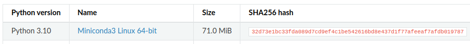

# OSMnx

OSMnx is a Python package that lets you download geospatial data from **OpenStreetMap**

```md
_**OpenStreetMap** provides map data for thousands of websites, mobile apps, and hardware devices

OpenStreetMap is built by a community of mappers that contribute and maintain data about roads, trails, cafés, railway stations, and much more, all over the world.

OpenStreetMap is open data: you are free to use it for any purpose as long as you credit OpenStreetMap and its contributors._
```

and model, project, visualize, and analyze real-world street networks and any other geospatial geometries. You can download and model walkable, drivable, or bikeable urban networks with a single line of Python code then easily analyze and visualize them. You can just as easily download and work with other infrastructure types, amenities/points of interest, building footprints, elevation data, street bearings/orientations, and speed/travel time.

```md
If you use OSMnx in your work, please cite the journal article:

Boeing, G. 2017. OSMnx: New Methods for Acquiring, Constructing, Analyzing, and Visualizing Complex Street Networks. Computers, Environment and Urban Systems 65, 126-139. doi:10.1016/j.compenvurbsys.2017.05.004
```

## INSTALLATION

**Reference:** `https://osmnx.readthedocs.io/en/stable/#`

Installing OSMnx with [conda](https://docs.conda.io/en/latest/).

### Conda Installation

```link
reference: https://docs.conda.io/projects/conda/en/stable/user-guide/install/linux.html#install-linux-silent
```

1. Download [Miniconda](https://docs.conda.io/en/latest/miniconda.html#linux-installers) wrt python version.

2. Verify your installer hashes

    - Linux: In a terminal window enter `sha256sum filename`.

        this will display SHA-256 hash value of your downloaded installer file

        example:

        ```bash
        (base) vipin@tulip:~$ sha256sum Downloads/Miniconda3-py310_23.1.0-1-Linux-x86_64.sh 
        32d73e1bc33fda089d7cd9ef4c1be542616bd8e437d1f77afeeaf7afdb019787  Downloads/Miniconda3-py310_23.1.0-1-Linux-x86_64.sh
        (base) vipin@tulip:~$ 
        ```

        here `32d73e1bc33fda089d7cd9ef4c1be542616bd8e437d1f77afeeaf7afdb019787` is SHA-256 hash value.

        compare it with SHA256 hash from where you downloaded it
        `https://docs.conda.io/en/latest/miniconda.html#linux-installers`
        

        if same you're good to go

3. In your terminal window, run:

    ```bash
    bash Miniconda3-latest-Linux-x86_64.sh
    ```

4. Follow the prompts on the installer screens.
    - If you are unsure about any setting, accept the defaults. You can change them later.

5. To make the changes take effect, close and then re-open your terminal window.

6. Now run `echo $PATH` to verify Conda is in you PATH, if not follow the following step:
    - Open a terminal window.

    - Type the following command to open the .bashrc file:

        `nano ~/.bashrc`

    - Add the following line at the end of the file:

        `export PATH="/home/your_username/miniconda3/bin:$PATH"`

    - Replace "your_username" with your actual username. If you installed Conda in a different location, adjust the path accordingly.

    - Press Ctrl+O to save the changes to the file.

    - Press Ctrl+X to exit the nano text editor.

    - Type the following command to apply the changes:

        `source ~/.bashrc`

        This reloads the .bashrc file with the new PATH environment variable.

    - To verify that Conda is in your PATH, type the following command:

        `echo $PATH`

        This should display a list of directories that includes the directory where Conda is installed.

    That's it! Conda is now added to your PATH environment variable and can be accessed from anywhere in the terminal.

7. Test your installation. In your terminal window or Anaconda Prompt, run the command `conda list`. A list of installed packages appears if it has been installed correctly.
or check version by running followin commands

    ```bash
    vipin@tulip:~$ conda --version
    conda 23.1.0
    ```

## Continue OSMnx Installation

```bash
conda config --prepend channels conda-forge
conda create -n osmnx_env --strict-channel-priority osmnx
```

_click [here](./notes.md) for explaination fo above commands_

now **restart** the terminal and activate `osmnx_env` environment

```bash
conda activate osmnx_env 
```

example

```bash
(base) vipin@tulip:~$ conda env list
# conda environments:
#
base                  *  /home/vipin/miniconda3
osmnx_env                /home/vipin/miniconda3/envs/osmnx_env

(base) vipin@tulip:~$ conda activate osmnx_env
(osmnx_env) vipin@tulip:~$ 
```

If you want other packages, such as `jupyterlab`, installed in this environment as well, just add their names after `osmnx` above. See the conda documentation for further details. To upgrade OSMnx to a newer release, remove the conda environment you created and then create a new one again, as above. Don’t just run “conda update” or you could get package conflicts.
